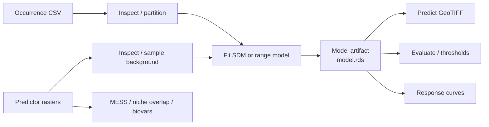

# dismo-mcp

`dismo-mcp` 是一个面向物种分布建模（Species Distribution Modeling, SDM）的 Model
Context Protocol（MCP）服务器。它把官方 R 包
[`rspatial/dismo`](https://github.com/rspatial/dismo) 的常用能力封装成有明确输入模式、
可追踪产物和受控文件访问边界的 MCP Tools。

`dismo-mcp` is an MCP server for species distribution modeling. It exposes selected
capabilities from the official R
[`rspatial/dismo`](https://github.com/rspatial/dismo) package through typed tools,
reproducible artifacts, and a constrained filesystem boundary.

> **状态 / Status:** `0.1.0`，功能型 alpha。适合本地研究、受控实验和 MCP 客户端集成；
> 生产部署还需要按本文的 HTTPS、令牌、资源限制和运行监控要求完成部署。
>
> `0.1.0`, functional alpha. It is suitable for local research, controlled experiments,
> and MCP client integration. Production deployments must apply the HTTPS, token,
> resource-limit, and operational controls described below.

## 目录 / Contents

- [项目定位 / What it provides](#项目定位--what-it-provides)
- [架构 / Architecture](#架构--architecture)
- [安装与运行 / Installation and running](#安装与运行--installation-and-running)
- [标准工作流 / Standard workflow](#标准工作流--standard-workflow)
- [Tools、Resources 和 Prompt](#toolsresources-和-prompt)
- [空间参考与可复现性 / CRS and reproducibility](#空间参考与可复现性--crs-and-reproducibility)
- [配置 / Configuration](#配置--configuration)
- [测试与开发 / Testing and development](#测试与开发--testing-and-development)
- [设计边界与路线图 / Boundaries and roadmap](#设计边界与路线图--boundaries-and-roadmap)

## 项目定位 / What it provides

### 中文

- 以 Python FastMCP 3 负责 MCP 协议、schema、stdio/HTTP/SSE 传输、Resources 和 Prompt。
- 以独立的 `Rscript --vanilla` 进程执行固定白名单操作；不提供任意 R 代码执行。
- 使用 `run_id` 管理模型、栅格、表格、GeoPackage、CSV 和 PDF 等不可变产物。
- 覆盖 BIOCLIM、Domain、Mahalanobis、MaxEnt（环境模型）以及凸包、矩形和圆形范围模型。
- 支持 occurrence 检查、背景点生成、k-fold 划分、held-out 评估、预测、MESS、响应曲线、
  生态位重叠和 BIOCLIM 气候变量计算。
- 对路径、CRS、经纬度范围、predictor manifest、训练/测试重叠和 R 资源使用进行校验。

### English

- Python FastMCP 3 owns the MCP protocol, schemas, stdio/HTTP/SSE transports, Resources,
  and the workflow Prompt.
- Each R operation runs in an isolated `Rscript --vanilla` process from a fixed allowlist;
  arbitrary R evaluation is intentionally unavailable.
- Models, rasters, tables, GeoPackages, CSV files, and PDFs are immutable artifacts addressed
  by `run_id`.
- Environmental models include BIOCLIM, Domain, Mahalanobis, and MaxEnt. Geographic models
  include convex-hull, rectangle-hull, circle-hull, and circles.
- Data QA, background sampling, k-fold partitioning, held-out evaluation, prediction, MESS,
  response curves, niche overlap, and BIOCLIM climate variables are included.
- Paths, CRS, geographic ranges, predictor manifests, train/test overlap, and R resource use
  are validated before or during execution.

## 架构 / Architecture



核心边界 / Core boundaries:

1. **MCP 层 / MCP layer**：Python 负责参数校验、权限 scope、路径策略、artifact metadata
   和结构化响应。
2. **桥接层 / Bridge layer**：`r_bridge.py` 负责排队、并发上限、超时、取消、进程崩溃
   恢复和响应文件读取。
3. **R 层 / R layer**：`r/bridge.R` 只实现固定 operation，调用 `dismo`、`raster`、
   `terra`、`sp` 和 `jsonlite`。
4. **产物层 / Artifact layer**：所有运行记录写入
   `.dismo-mcp/runs/<run_id>/`，后续 Tools 只从受控 metadata 解析产物。

完整的官方包分析、Tool 映射和扩展边界见
[`docs/architecture.md`](docs/architecture.md)。

See [`docs/architecture.md`](docs/architecture.md) for the upstream package analysis,
Tool mapping, protocol decisions, spatial contracts, and future extensions.

## 安装与运行 / Installation and running

### 前置条件 / Prerequisites

- Python 3.11+ and [`uv`](https://docs.astral.sh/uv/)
- R 3.6.3+
- Required R packages / 必需 R 包：`dismo`, `raster`, `sp`, `terra`, `jsonlite`
- Optional MaxEnt dependencies / MaxEnt 可选依赖：Java and `rJava`
- Optional ecosystem dependencies / 可选生态模型依赖：`gbm`, `randomForest`, `kernlab`, `ROCR`

在 R 中安装核心依赖（示例）/ Install the core R dependencies (example):

```r
install.packages(c("dismo", "raster", "sp", "terra", "jsonlite"))
```

### 本地 stdio / Local stdio

stdio 是 Codex Desktop、Claude Desktop 等本地 MCP 客户端的默认方式，不需要开放网络端口。

stdio is the default for local MCP clients such as Codex Desktop and Claude Desktop; it does
not expose a network listener.

```powershell
uv sync --extra dev
uv run dismo-mcp
```

启动后建议先调用 `dismo_system_info`，确认 `Rscript`、`dismo` 版本和 MaxEnt 可用性。

After startup, call `dismo_system_info` first to verify the resolved `Rscript`, package versions,
and MaxEnt availability.

### 本机 HTTP / Local HTTP

HTTP、SSE 和 Streamable HTTP 只允许绑定回环地址，并且必须配置 Bearer token。下面的
Streamable HTTP 示例仅用于本机或由 HTTPS 反向代理保护的本机监听器：

HTTP, SSE, and Streamable HTTP are restricted to loopback binding and always require a Bearer
token. The following Streamable HTTP example is for local use or a local listener protected by
an HTTPS reverse proxy:

```powershell
$env:DISMO_MCP_BEARER_TOKEN = [Convert]::ToHexString(
  [Security.Cryptography.RandomNumberGenerator]::GetBytes(32)
)
uv run dismo-mcp --transport http --host 127.0.0.1 --port 8000
```

`DISMO_MCP_BEARER_TOKEN` 同时授予 `dismo:read` 和 `dismo:write`。更小权限的部署应分别
配置 `DISMO_MCP_READ_TOKEN` 与 `DISMO_MCP_WRITE_TOKEN`。Token 至少 32 个字符。

`DISMO_MCP_BEARER_TOKEN` grants both `dismo:read` and `dismo:write`. For least privilege,
configure `DISMO_MCP_READ_TOKEN` and `DISMO_MCP_WRITE_TOKEN` separately. Tokens must contain at
least 32 characters.

公开访问要求 / Public access requirements:

- 不要把 `--host` 设置为 `0.0.0.0` 或其他非回环地址。
- 不要把明文 HTTP 直接暴露到局域网或公网。
- 使用 HTTPS reverse proxy 终止 TLS，再转发到 `127.0.0.1`。
- 设置 `DISMO_MCP_PUBLIC_BASE_URL=https://your-host.example`，使返回的资源 URL 使用公开
  HTTPS 地址。
- `create_http_app()` 和 `create_http_server()` 会重复执行绑定与认证校验；未认证的
  `create_server()` 不能创建 HTTP app。

- Do not bind `--host` to `0.0.0.0` or another non-loopback address.
- Do not expose plain HTTP directly to a LAN or the Internet.
- Terminate TLS in an HTTPS reverse proxy and forward to `127.0.0.1`.
- Set `DISMO_MCP_PUBLIC_BASE_URL=https://your-host.example` so generated resource URLs use the
  public HTTPS origin.
- `create_http_app()` and `create_http_server()` enforce the binding and authentication checks;
  an unauthenticated `create_server()` cannot create an HTTP app.

### MCP 客户端配置 / MCP client configuration

Windows 示例 / Windows example:

```json
{
  "mcpServers": {
    "dismo": {
      "command": "uv",
      "args": ["--directory", "F:\\DISMO", "run", "dismo-mcp"],
      "env": {
        "DISMO_MCP_WORKSPACE": "F:\\DISMO"
      }
    }
  }
}
```

Linux/macOS 将 `--directory` 和 `DISMO_MCP_WORKSPACE` 改为项目绝对路径。客户端不应把
Bearer token 写入配置文件或命令行历史；通过受保护的环境变量注入。

On Linux/macOS, replace the Windows paths with absolute project paths. Do not put Bearer tokens
in client configuration files or shell history; inject them through a protected environment.

## 标准工作流 / Standard workflow

一个可复现的 presence-only SDM 工作流如下。每一步返回的 `run_id` 或 artifact 路径都应
作为下一步的输入，不要手工替换模型文件。

A reproducible presence-only SDM workflow looks like this. Pass the returned `run_id` or artifact
path to the next step instead of substituting model files manually.

1. **检查输入 / Inspect inputs**：调用 `dismo_system_info`、`inspect_raster` 和
   `inspect_occurrences`。
2. **准备数据 / Prepare data**：调用 `extract_predictor_values`；需要背景点时调用
   `generate_background_points`。
3. **划分折 / Partition folds**：调用 `partition_occurrences`，保存其 `folds.csv`。
4. **训练 / Fit**：调用 `fit_sdm`，并传入 `folds_path`、`held_out_fold` 或 `train_folds`。
   生成背景点时优先传入 `background_run_id`，让服务自动继承栅格 CRS。
5. **预测 / Predict**：调用 `predict_sdm`，传入 `model_run_id` 和相同 predictor 数据集。
6. **评估 / Evaluate**：调用 `evaluate_sdm`，传入同一 folds artifact 的 `test_fold`。
   默认会拒绝与训练 occurrence 重叠的 presence 坐标。
7. **解释 / Interpret**：按需调用 `create_response_curves`、`calculate_mess`、
   `calculate_niche_overlap` 或 `compute_bioclimatic_variables`。
8. **管理产物 / Manage artifacts**：使用 `list_runs`、`get_run` 和 `cancel_run`。

### Held-out 示例 / Held-out example

```text
partition_occurrences(occurrences_path, k=5)
  -> folds.csv + fold metadata

fit_sdm(..., folds_path="<partition-run>/folds.csv", held_out_fold=2)
  -> model_run_id + training_points artifact

evaluate_sdm(..., folds_path="<partition-run>/folds.csv", test_fold=2,
             model_run_id="<model-run>")
  -> AUC/TSS/Kappa/threshold table
```

`fit_sdm` 只读取训练折；`evaluate_sdm` 只读取测试折。只有显式设置
`allow_training_overlap=true` 才能绕过训练点重叠保护。

`fit_sdm` reads training folds only, while `evaluate_sdm` reads the selected test fold only.
The training-overlap guard can be bypassed only with the explicit
`allow_training_overlap=true` option.

## Tools、Resources 和 Prompt

当前公开表面为 **17 个 Tools、2 个 Resources、1 个 Prompt**。

The current public surface contains **17 Tools, 2 Resources, and 1 Prompt**.

| 类别 / Category | Tools | 说明 / Description |
| --- | --- | --- |
| 诊断 / Diagnostics | `dismo_system_info` | R、包版本和 MaxEnt 探测 / Runtime and package diagnostics |
| 输入 QA / Input QA | `inspect_raster`, `inspect_occurrences` | 栅格几何、层和坐标检查 / Raster geometry, layers, and coordinate checks |
| 数据准备 / Preparation | `extract_predictor_values`, `generate_background_points`, `partition_occurrences` | 提取、背景采样和 k-fold / Extraction, background sampling, and folds |
| 环境模型 / Environmental models | `fit_sdm` | BIOCLIM、Domain、Mahalanobis、MaxEnt |
| 范围模型 / Range models | `fit_range_model` | `convHull`, `rectHull`, `circleHull`, `circles` |
| 推理 / Inference | `predict_sdm` | 生成预测栅格 / Prediction rasters |
| 评估 / Validation | `evaluate_sdm` | AUC、TSS、Kappa、阈值表 / Metrics and thresholds |
| 解释 / Interpretation | `create_response_curves`, `calculate_mess` | 响应曲线和外推风险 / Response curves and extrapolation risk |
| 比较 / Comparison | `calculate_niche_overlap`, `compute_bioclimatic_variables` | 生态位重叠和气候变量 / Niche overlap and climate variables |
| 运行控制 / Run control | `list_runs`, `get_run`, `cancel_run` | 运行记录和取消 / Run metadata and cancellation |

Resources:

- `dismo://capabilities`：当前能力、模型和传输说明 / capability summary。
- `dismo://runs/{run_id}`：受控运行 metadata / controlled run metadata。

Prompt:

- `species_distribution_workflow`：引导客户端按检查、划分、训练、评估和解释顺序工作 / a
  workflow guide for inspection, partitioning, fitting, evaluation, and interpretation.

## 空间参考与可复现性 / CRS and reproducibility

### CRS 合同 / CRS contract

- occurrence/environmental points 使用 `point_crs`，默认 `EPSG:4326`。
- range models 使用 `crs`。
- `lonlat=true` 时强制检查 longitude `[-180, 180]`、latitude `[-90, 90]`。
- 投影点会转换到 predictor raster CRS；没有 CRS 的空间栅格会明确失败。
- `generate_background_points` 的结果记录 `output_crs`。跨 Tool 使用时传入
  `background_run_id` 或 `absence_run_id`，不要猜测 CRS。
- 文件形式的 background/absence 必须显式提供 `background_crs`/`absence_crs`。

- Occurrence and environmental points use `point_crs`, defaulting to `EPSG:4326`.
- Range models use `crs`.
- With `lonlat=true`, longitude `[-180, 180]` and latitude `[-90, 90]` are mandatory.
- Projected points are transformed to the predictor raster CRS; rasters without CRS fail clearly.
- `generate_background_points` records `output_crs`. Pass its run ID as `background_run_id` or
  `absence_run_id` across Tools instead of guessing the CRS.
- File-based background/absence inputs must declare `background_crs`/`absence_crs` explicitly.

### Predictor provenance

训练模型会保存 predictor manifest，包括：

- 主文件及常见 sidecar 的 SHA-256；
- 层名、层数、范围、分辨率和 CRS；
- 训练时的 raster geometry。

`predict_sdm` 和 `evaluate_sdm` 会在 Python 预检和 R bridge 内部校验 manifest。因此即使
文件名、层名和 CRS 相同，只要内容或栅格几何改变，也会拒绝静默运行。

Fitted models store a predictor manifest containing SHA-256 hashes for the main file and common
sidecars, layer names/count, extent, resolution, CRS, and raster geometry. Both `predict_sdm` and
`evaluate_sdm` validate it in Python and in the R bridge, so changed content or geometry cannot be
silently substituted under the same filename.

### 产物 / Artifacts

每个运行目录类似于 / Each run directory looks like:

```text
.dismo-mcp/
└── runs/
    └── <run_id>/
        ├── metadata.json
        ├── model.rds                 # model runs only
        ├── predictor_manifest.json   # model runs only
        ├── training_points.csv       # fold-filtered training data
        ├── prediction.tif             # prediction runs
        ├── evaluation.json            # evaluation runs
        └── *.csv / *.gpkg / *.pdf
```

`.dismo-mcp/` 已被 `.gitignore` 排除，不应提交到源代码仓库。

`.dismo-mcp/` is ignored by `.gitignore` and should not be committed to the source repository.

## 配置 / Configuration

所有变量均可通过环境变量配置 / All settings are configured through environment variables:

| 变量 / Variable | 默认 / Default | 用途 / Purpose |
| --- | --- | --- |
| `DISMO_MCP_WORKSPACE` | current directory | 输入根目录和运行产物 / input root and artifacts |
| `DISMO_MCP_ALLOWED_ROOTS` | workspace only | 额外允许的输入根 / additional input roots |
| `DISMO_MCP_RSCRIPT` | auto-detected | `Rscript` 绝对路径 / absolute executable path |
| `DISMO_MCP_TIMEOUT_SECONDS` | `600` | 单次 R 操作超时 / per-operation timeout |
| `DISMO_MCP_TRANSPORT` | `stdio` | `stdio`, `http`, `streamable-http`, `sse` |
| `DISMO_MCP_HOST` / `DISMO_MCP_PORT` | `127.0.0.1` / `8000` | 网络绑定 / network binding |
| `DISMO_MCP_BEARER_TOKEN` | unset | 完整读写 token / full read-write token |
| `DISMO_MCP_READ_TOKEN` | unset | 只读 token / read-only token |
| `DISMO_MCP_WRITE_TOKEN` | unset | 读写 token / read-write token |
| `DISMO_MCP_PUBLIC_BASE_URL` | local HTTP URL | 反向代理后的 HTTPS 公开地址 / public HTTPS origin |
| `DISMO_MCP_MAX_CONCURRENT_R` | `2` | 最大并发 R 进程 / concurrent R processes |
| `DISMO_MCP_MAX_QUEUED_R` | `8` | 最大排队任务 / queued operations |
| `DISMO_MCP_QUEUE_WAIT_SECONDS` | `30` | 最大排队等待 / queue wait |
| `DISMO_MCP_MAX_RASTER_CELLS` | `50000000` | 栅格 cells × layers 上限 / raster cell-layer limit |
| `DISMO_MCP_MAX_POINT_ROWS` | `1000000` | 点表行数上限 / point-table row limit |
| `DISMO_MCP_MAX_INPUT_BYTES` | `2000000000` | 输入文件大小上限 / input size limit |
| `DISMO_MCP_MAX_R_MEMORY_MB` | `4096` | R vector heap 上限 / R vector-heap limit |

资源限制用于控制误用和并发压力；`R_MAX_VSIZE` 不是 Windows 进程 RSS 或 Job Object 的
完整替代。需要更严格的生产隔离时，应在容器、作业调度器或操作系统级资源控制中增加
内存、CPU、磁盘和进程级限制。

These limits control accidental overload and concurrency pressure. `R_MAX_VSIZE` is not a full
replacement for a Windows RSS or Job Object limit. Production deployments requiring hard isolation
should add container, scheduler, or OS-level CPU, memory, disk, and process limits.

## 测试与开发 / Testing and development

安装开发依赖 / Install development dependencies:

```powershell
uv sync --extra dev
```

运行快速 Python 测试 / Run the fast Python test suite:

```powershell
uv run pytest
```

运行真实 R 集成测试（需要本机 R 和 `dismo` 示例数据）/ Run real R integration tests
(requires local R and the `dismo` example data):

```powershell
uv run pytest -m integration
```

没有 R 或示例数据时，集成测试会以 `skip` 结束；这不代表 MaxEnt、Java 或所有模型变体
都已在当前机器上验证。MaxEnt 依赖 `rJava`/Java，测试会根据环境条件执行。

When R or example data is unavailable, integration tests are skipped. That does not claim that
MaxEnt, Java, or every model variant is available on the current machine. MaxEnt tests are
conditional on `rJava`/Java.

项目结构 / Project layout:

```text
src/dismo_mcp/
├── server.py       # Tools, Resources, Prompt, app factories
├── r_bridge.py     # isolated R processes, queue, timeout, cancellation
├── provenance.py   # predictor manifests and validation
├── artifacts.py    # run metadata and artifact policy
├── auth.py         # Bearer token verification and scopes
├── config.py       # environment configuration and path policy
└── r/bridge.R      # fixed R operation allowlist
tests/              # unit, security, resource, and R integration tests
docs/architecture.md # upstream and architecture analysis
```

## 设计边界与路线图 / Boundaries and roadmap

### 当前不直接包装 / Intentionally not exposed directly

官方 `dismo` 还包含 `gbif`、`geocode`、`gmap`、交互式绘图、内部 BRT helper 和低层函数。
它们暂不作为一比一 MCP Tool：

The upstream package also contains `gbif`, `geocode`, `gmap`, interactive plotting, internal BRT
helpers, and low-level functions. They are not exposed one-to-one because:

- 旧版 web helper 依赖外部 API、凭据和不稳定的服务合同 / legacy web helpers depend on
  aging APIs and credentials;
- 任意函数分发会破坏 schema、文件系统和安全边界 / arbitrary dispatch would erase the
  schema, filesystem, and security boundary;
- 绘图结果需要稳定的结构化产物，而不是只返回交互式窗口 / plotting needs stable artifacts;
- GLM/BRT/RF 等通用学习器需要单独的表格模型合同 / generic learners need an explicit
  tabular-model contract.

### 后续方向 / Next steps

1. 常驻 R worker pool、进度通知和更细粒度的取消 / resident R workers, progress events,
   and finer cancellation。
2. 真正的空间阻塞交叉验证和更丰富的采样设计 / spatial-block cross-validation and richer
   sampling designs。
3. GLM、BRT、RF 等通用表格模型的显式 schema / explicit schemas for GLM, BRT, RF, and
   other tabular models。
4. 对象存储、审计日志和部署级指标 / object storage, audit logs, and deployment metrics。
5. 通过独立 provider 集成现代 GBIF API，而不是继续扩展旧版 `dismo::gbif` / integrate a
   modern GBIF provider instead of extending the legacy `dismo::gbif` helper。

## 许可证 / License

本项目采用 MIT License。`dismo-mcp` 通过 R 进程调用官方 `dismo` 及其依赖；请同时遵守
这些上游项目各自的许可证和使用条款。

This project is released under the MIT License. `dismo-mcp` invokes the upstream `dismo` R
package and its dependencies; comply with the licenses and terms of those upstream projects.
