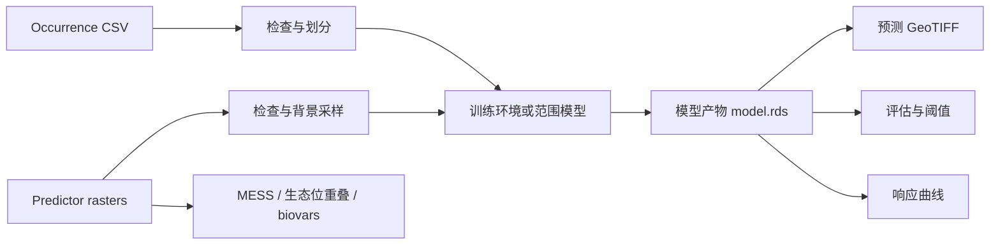

# dismo-mcp

[简体中文](README.md) | [English](README_EN.md)

基于官方 R 包 [`rspatial/dismo`](https://github.com/rspatial/dismo) 构建的物种分布建模
Model Context Protocol（MCP）服务器。

`dismo-mcp` 将常用物种分布建模能力封装为具有明确输入模式、受控文件访问、可追踪产物
和科研数据约束的 MCP Tools。它适用于 Codex Desktop、Claude Desktop 等本地 MCP 客户端，
也支持经过认证的本机 HTTP/SSE/Streamable HTTP 集成。

> **当前状态：** `0.1.0`，功能型 alpha。适合本地研究、受控实验和 MCP 客户端集成。
> 生产部署还需要遵循本文的 HTTPS、令牌、资源隔离和运行监控要求。

## 目录

- [核心能力](#核心能力)
- [系统架构](#系统架构)
- [安装与运行](#安装与运行)
- [标准建模工作流](#标准建模工作流)
- [Tools、Resources 和 Prompt](#toolsresources-和-prompt)
- [空间参考与可复现性](#空间参考与可复现性)
- [运行产物](#运行产物)
- [配置](#配置)
- [测试与开发](#测试与开发)
- [设计边界与路线图](#设计边界与路线图)
- [许可证](#许可证)

## 核心能力

- **17 个领域 Tools**：覆盖输入检查、数据准备、环境模型、范围模型、预测、评估、解释
  和运行控制。
- **4 个环境模型**：BIOCLIM、Domain、Mahalanobis 和 MaxEnt。
- **4 个范围模型**：凸包、矩形包络、圆形包络和多圆范围模型。
- **真实 held-out 评估**：按 fold 过滤训练集与测试集，默认检测训练点重叠。
- **完整 CRS 合同**：检查经纬度范围，转换投影坐标，并保留范围模型几何 CRS。
- **Predictor provenance**：记录文件哈希、sidecar、层名、范围、分辨率、CRS 和栅格几何。
- **受控 R 执行**：每个操作在独立 `Rscript --vanilla` 进程中执行，不开放任意 R 代码。
- **资源治理**：支持并发和队列上限、超时、取消、输入大小、栅格 cell 和点表行数限制。
- **可追踪产物**：模型、GeoTIFF、GeoPackage、CSV、JSON 和 PDF 都归属不可变 `run_id`。
- **安全传输**：stdio 默认本地运行；HTTP 强制 Bearer token 和回环绑定。

## 系统架构



系统分为四层：

1. **MCP 层**：Python FastMCP 3 负责 Tool schema、stdio/HTTP/SSE 传输、Resources、
   Prompt、权限 scope 和结构化响应。
2. **桥接层**：`r_bridge.py` 负责有界队列、并发上限、超时、取消、进程失败恢复和 JSON
   响应读取。
3. **R 执行层**：`r/bridge.R` 只接受固定 operation 白名单，调用 `dismo`、`raster`、
   `terra`、`sp` 和 `jsonlite`。
4. **产物层**：所有运行记录写入 `.dismo-mcp/runs/<run_id>/`；后续 Tools 通过受控
   metadata 解析模型和数据产物。

每次 R 操作使用独立进程，避免 Java/原生扩展崩溃破坏 MCP 主进程，也防止请求之间共享
`.GlobalEnv` 或随机状态。R 的 stdout/stderr 不会污染 stdio MCP 协议。

官方项目分析、Tool 映射原则和详细设计见
[`docs/architecture.md`](docs/architecture.md)。

## 安装与运行

### 前置条件

- Python 3.11 或更高版本
- [`uv`](https://docs.astral.sh/uv/)
- R 3.6.3 或更高版本
- 必需 R 包：`dismo`、`raster`、`sp`、`terra`、`jsonlite`
- MaxEnt 可选依赖：Java、`rJava`
- 其他可选依赖：`gbm`、`randomForest`、`kernlab`、`ROCR`

安装核心 R 依赖：

```r
install.packages(c("dismo", "raster", "sp", "terra", "jsonlite"))
```

### 本地 stdio

stdio 是推荐的默认方式，不开放网络端口，适合 Codex Desktop、Claude Desktop 等本地
MCP 客户端。

```powershell
uv sync --extra dev
uv run dismo-mcp
```

启动后建议首先调用 `dismo_system_info`，确认 `Rscript` 路径、包版本和 MaxEnt 可用性。

### MCP 客户端配置

Windows 示例：

```json
{
  "mcpServers": {
    "dismo": {
      "command": "uv",
      "args": ["--directory", "F:\\DISMO", "run", "dismo-mcp"],
      "env": {
        "DISMO_MCP_WORKSPACE": "F:\\DISMO"
      }
    }
  }
}
```

在 Linux/macOS 上，将 `--directory` 和 `DISMO_MCP_WORKSPACE` 改为项目绝对路径。

### 本机 HTTP

HTTP、SSE 和 Streamable HTTP 只允许绑定回环地址，并且必须配置 Bearer token：

```powershell
$env:DISMO_MCP_BEARER_TOKEN = [Convert]::ToHexString(
  [Security.Cryptography.RandomNumberGenerator]::GetBytes(32)
)
uv run dismo-mcp --transport http --host 127.0.0.1 --port 8000
```

`DISMO_MCP_BEARER_TOKEN` 同时授予 `dismo:read` 和 `dismo:write`。需要最小权限时，分别
配置 `DISMO_MCP_READ_TOKEN` 和 `DISMO_MCP_WRITE_TOKEN`。Token 至少为 32 个字符。

公开访问必须满足以下条件：

- 不要把服务直接绑定到 `0.0.0.0` 或其他非回环地址。
- 不要把明文 HTTP 直接暴露到局域网或公网。
- 使用 HTTPS 反向代理终止 TLS，再转发到 `127.0.0.1`。
- 设置 `DISMO_MCP_PUBLIC_BASE_URL=https://your-host.example`，使资源 URL 使用公开 HTTPS
  地址。
- 不要把 Bearer token 写入命令行历史、仓库文件或普通客户端配置文件。

`create_http_app()` 和 `create_http_server()` 会执行绑定与认证校验；未认证的
`create_server()` 不能创建 HTTP app。HTTP 错误默认隐藏内部异常细节。

## 标准建模工作流

一个可复现的 presence-only SDM 工作流如下。每一步返回的 `run_id` 或 artifact 应作为
下一步输入，不要手工替换序列化模型文件。

1. **运行环境诊断**：调用 `dismo_system_info`。
2. **检查输入**：调用 `inspect_raster` 和 `inspect_occurrences`。
3. **准备数据**：调用 `extract_predictor_values`；需要背景点时调用
   `generate_background_points`。
4. **划分数据**：调用 `partition_occurrences` 生成带 `fold` 列的 `folds.csv`。
5. **训练模型**：调用 `fit_sdm`，传入 `folds_path`、`held_out_fold` 或 `train_folds`。
   对生成的背景点优先传入 `background_run_id`，让服务自动继承栅格 CRS。
6. **空间预测**：调用 `predict_sdm`，传入 `model_run_id` 和训练时的 predictor 数据集。
7. **独立评估**：调用 `evaluate_sdm`，传入同一 folds artifact 的 `test_fold`。默认拒绝
   与训练 occurrence 重叠的 presence 坐标。
8. **模型解释**：按需调用 `create_response_curves`、`calculate_mess`、
   `calculate_niche_overlap` 或 `compute_bioclimatic_variables`。
9. **管理运行**：使用 `list_runs`、`get_run` 和 `cancel_run`。

### Held-out 示例

```text
partition_occurrences(occurrences_path, k=5)
  -> folds.csv + fold metadata

fit_sdm(..., folds_path="<partition-run>/folds.csv", held_out_fold=2)
  -> model_run_id + training_points artifact

evaluate_sdm(..., folds_path="<partition-run>/folds.csv", test_fold=2,
             model_run_id="<model-run>")
  -> AUC / TSS / Kappa / threshold table
```

`fit_sdm` 只读取训练折，`evaluate_sdm` 只读取指定测试折。只有显式设置
`allow_training_overlap=true` 才会绕过训练点重叠保护。

## Tools、Resources 和 Prompt

当前公开表面为 **17 个 Tools、2 个 Resources、1 个 Prompt**。

| 类别 | Tools | 说明 |
| --- | --- | --- |
| 诊断 | `dismo_system_info` | R、包版本和 MaxEnt 探测 |
| 输入 QA | `inspect_raster`, `inspect_occurrences` | 栅格几何、层、CRS 和坐标检查 |
| 数据准备 | `extract_predictor_values`, `generate_background_points`, `partition_occurrences` | 提取、背景采样和 k-fold |
| 环境模型 | `fit_sdm` | BIOCLIM、Domain、Mahalanobis、MaxEnt |
| 范围模型 | `fit_range_model` | `convHull`, `rectHull`, `circleHull`, `circles` |
| 推理 | `predict_sdm` | 生成预测 GeoTIFF |
| 评估 | `evaluate_sdm` | AUC、相关性、TSS、Kappa 和阈值表 |
| 解释 | `create_response_curves`, `calculate_mess` | 响应曲线和外推风险 |
| 比较与气候 | `calculate_niche_overlap`, `compute_bioclimatic_variables` | 生态位重叠和 BIOCLIM 变量 |
| 运行控制 | `list_runs`, `get_run`, `cancel_run` | 运行 metadata、产物和取消 |

Resources：

- `dismo://capabilities`：当前能力、模型和传输说明。
- `dismo://runs/{run_id}`：受控运行 metadata。

Prompt：

- `species_distribution_workflow`：引导客户端按检查、划分、训练、评估和解释顺序完成
  SDM 工作流。

## 空间参考与可复现性

### CRS 合同

- occurrence 和环境点使用 `point_crs`，默认 `EPSG:4326`。
- 范围模型使用 `crs`。
- `lonlat=true` 时强制检查经度 `[-180, 180]`、纬度 `[-90, 90]`。
- 投影点会转换到 predictor raster CRS；没有 CRS 的空间栅格会明确失败。
- `generate_background_points` 记录 `output_crs`。跨 Tool 使用时传入
  `background_run_id` 或 `absence_run_id`，不要猜测 CRS。
- 文件形式的 background/absence 必须显式提供 `background_crs`/`absence_crs`。
- `circles` 等范围模型在 GeoPackage 导出时保留用户提供的 CRS。

### Predictor provenance

训练模型会保存 predictor manifest，包括：

- 主文件及常见 sidecar 的 SHA-256；
- 层名和层数；
- 范围、分辨率和 CRS；
- 训练时的完整栅格几何。

`predict_sdm` 和 `evaluate_sdm` 会在 Python 预检和 R bridge 内部校验 manifest。因此，
即使文件名、层名和 CRS 相同，只要内容或栅格几何改变，也会拒绝静默运行。

### 数据泄漏保护

- `partition_occurrences` 生成可复用的 fold artifact。
- `fit_sdm` 根据 fold 参数构造真实训练子集，并记录精确 `training_points` artifact。
- `evaluate_sdm` 根据 `test_fold` 构造测试集。
- 默认检查测试 presence 与训练点是否重叠。
- 绕过保护必须显式设置 `allow_training_overlap=true`。

## 运行产物

每个运行目录结构类似于：

```text
.dismo-mcp/
└── runs/
    └── <run_id>/
        ├── metadata.json
        ├── model.rds                 # 仅模型运行
        ├── predictor_manifest.json   # 仅模型运行
        ├── training_points.csv       # fold 过滤后的训练数据
        ├── prediction.tif             # 预测运行
        ├── evaluation.json            # 评估运行
        └── *.csv / *.gpkg / *.pdf
```

`.dismo-mcp/` 已被 `.gitignore` 排除，不应提交到源代码仓库。模型消费类 Tools 接受
`model_run_id`，服务端从受控 metadata 解析 `model.rds`，客户端不能替换任意 RDS 对象。

## 配置

| 环境变量 | 默认值 | 用途 |
| --- | --- | --- |
| `DISMO_MCP_WORKSPACE` | 当前目录 | 输入根目录和运行产物 |
| `DISMO_MCP_ALLOWED_ROOTS` | 仅 workspace | 额外允许的输入根，按 OS 路径分隔符分隔 |
| `DISMO_MCP_RSCRIPT` | 自动探测 | `Rscript` 绝对路径 |
| `DISMO_MCP_TIMEOUT_SECONDS` | `600` | 单次 R 操作超时 |
| `DISMO_MCP_TRANSPORT` | `stdio` | `stdio`, `http`, `streamable-http`, `sse` |
| `DISMO_MCP_HOST` / `DISMO_MCP_PORT` | `127.0.0.1` / `8000` | 网络绑定 |
| `DISMO_MCP_BEARER_TOKEN` | 未设置 | 完整读写 token |
| `DISMO_MCP_READ_TOKEN` | 未设置 | 只读 token |
| `DISMO_MCP_WRITE_TOKEN` | 未设置 | 读写 token |
| `DISMO_MCP_PUBLIC_BASE_URL` | 本机 HTTP URL | 反向代理后的 HTTPS 公开地址 |
| `DISMO_MCP_MAX_CONCURRENT_R` | `2` | 最大并发 R 进程数 |
| `DISMO_MCP_MAX_QUEUED_R` | `8` | 最大排队任务数 |
| `DISMO_MCP_QUEUE_WAIT_SECONDS` | `30` | 最大排队等待时间 |
| `DISMO_MCP_MAX_RASTER_CELLS` | `50000000` | 栅格 cells × layers 上限 |
| `DISMO_MCP_MAX_POINT_ROWS` | `1000000` | 点表行数上限 |
| `DISMO_MCP_MAX_INPUT_BYTES` | `2000000000` | 单个输入文件大小上限 |
| `DISMO_MCP_MAX_R_MEMORY_MB` | `4096` | R vector heap 上限 |
| `DISMO_MCP_MAX_RUNS` | `1000` | 工作区最多保留的 run 数量；创建新 run 时优先清理已完成 run |
| `DISMO_MCP_MAX_RUN_BYTES` | `10000000000` | run 目录总容量上限（字节） |
| `DISMO_MCP_RUN_RETENTION_SECONDS` | `0` | 已完成 run 的保留时间；`0` 表示不按时间自动清理 |

这些限制用于控制误用和并发压力。`R_MAX_VSIZE` 不是 Windows 进程 RSS 或 Job Object 的
完整替代；需要严格生产隔离时，应在容器、作业调度器或操作系统层增加 CPU、内存、磁盘
和进程限制。
run 目录也受数量、总容量和可选保留期限制。清理只针对已完成、失败或取消的 run；如果
所有现存 run 都仍在运行，服务会拒绝创建新任务而不会删除活动任务。

## 测试与开发

安装开发依赖：

```powershell
uv sync --extra dev
```

运行测试：

```powershell
uv run pytest
```

只运行真实 R 集成测试：

```powershell
uv run pytest -m integration
```

真实 R 集成测试需要本机 R、核心依赖和 `dismo` 示例数据。环境缺失时测试会跳过；这不
代表 MaxEnt、Java 或所有模型变体已在当前机器验证。MaxEnt 测试根据 `rJava`/Java 条件
执行。

项目结构：

```text
src/dismo_mcp/
├── server.py        # Tools、Resources、Prompt 和 app factories
├── r_bridge.py      # R 进程、队列、超时和取消
├── provenance.py    # predictor manifests 与校验
├── artifacts.py     # run metadata 与产物策略
├── auth.py          # Bearer token 与权限 scope
├── config.py        # 环境配置与路径策略
└── r/bridge.R       # 固定 R operation 白名单
tests/               # 单元、安全、资源和 R 集成测试
docs/architecture.md # 官方项目与架构分析
```

## 设计边界与路线图

### 当前不直接包装

官方 `dismo` 还包含 `gbif`、`geocode`、`gmap`、交互式绘图、内部 BRT helper 和低层函数。
它们暂不作为一比一 MCP Tool：

- 旧版 web helper 依赖外部 API、凭据和不稳定的服务合同。
- 任意函数分发会破坏 schema、文件系统和安全边界。
- 绘图需要稳定的结构化产物，而不是只返回交互式窗口。
- GLM/BRT/RF 等通用学习器需要独立、明确的表格模型合同。

### 后续方向

1. 常驻 R worker pool、进度通知和更细粒度的取消。
2. 真正的空间阻塞交叉验证和更丰富的采样设计。
3. GLM、BRT、RF 等通用表格模型的显式 schema。
4. 对象存储、审计日志和部署级指标。
5. 通过独立 provider 集成现代 GBIF API，而不是继续扩展旧版 `dismo::gbif`。

## 许可证

`dismo-mcp` 自身源代码采用 [MIT License](LICENSE)。

这是一个独立的 MCP 集成项目，不隶属、也不代表 `rspatial/dismo` 或其维护者。本仓库和
Python 包不包含或再分发 R、`dismo`、其他 R 包、Java、`maxent.jar`、模型产物、示例数据
或用户数据。使用者自行安装这些前置组件，并分别遵守它们适用的许可证和条款。

直接依赖及其许可证见 [THIRD_PARTY_NOTICES.md](THIRD_PARTY_NOTICES.md)。未来若发布包含
运行时的容器或离线安装包，需要为其中实际捆绑的精确版本补充相应声明。

---

[简体中文](README.md) | [English](README_EN.md)
