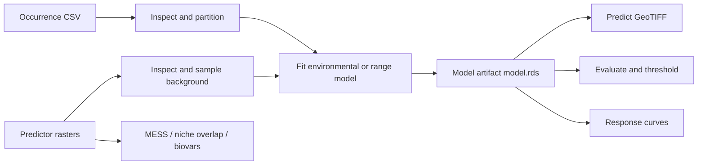

# dismo-mcp

[简体中文](README.md) | [English](README_EN.md)

A Model Context Protocol (MCP) server for species distribution modeling, built on the official R
package [`rspatial/dismo`](https://github.com/rspatial/dismo).

`dismo-mcp` exposes common species distribution modeling operations as typed MCP Tools with
controlled file access, traceable artifacts, and scientific data contracts. It works with local
MCP clients such as Codex Desktop and Claude Desktop and also supports authenticated local
HTTP/SSE/Streamable HTTP integrations.

> **Status:** `0.1.0`, functional alpha. It is suitable for local research, controlled
> experiments, and MCP client integration. Production deployments must apply the HTTPS, token,
> resource-isolation, and operational monitoring controls described below.

## Contents

- [Key capabilities](#key-capabilities)
- [Architecture](#architecture)
- [Installation and running](#installation-and-running)
- [Standard modeling workflow](#standard-modeling-workflow)
- [Tools, Resources, and Prompt](#tools-resources-and-prompt)
- [CRS and reproducibility](#crs-and-reproducibility)
- [Run artifacts](#run-artifacts)
- [Configuration](#configuration)
- [Testing and development](#testing-and-development)
- [Design boundaries and roadmap](#design-boundaries-and-roadmap)

## Key capabilities

- **17 domain Tools:** input QA, data preparation, environmental and range models, prediction,
  evaluation, interpretation, and run control.
- **4 environmental models:** BIOCLIM, Domain, Mahalanobis, and MaxEnt.
- **4 range models:** convex hull, rectangular hull, circle hull, and multi-circle range models.
- **Real held-out evaluation:** training and test rows are filtered by fold, with training-point
  overlap checks enabled by default.
- **Complete CRS contract:** geographic ranges are validated, projected coordinates are
  transformed, and range-model geometries retain their CRS.
- **Predictor provenance:** file hashes, sidecars, layer names, extent, resolution, CRS, and raster
  geometry are recorded and verified.
- **Controlled R execution:** each operation runs in an isolated `Rscript --vanilla` process;
  arbitrary R evaluation is not exposed.
- **Resource governance:** bounded concurrency and queues, timeouts, cancellation, input-size,
  raster-cell, and point-row limits.
- **Traceable artifacts:** models, GeoTIFFs, GeoPackages, CSV, JSON, and PDF outputs belong to an
  immutable `run_id`.
- **Secure transports:** stdio is local by default; HTTP requires a Bearer token and loopback
  binding.

## Architecture



The system has four layers:

1. **MCP layer:** Python FastMCP 3 owns Tool schemas, stdio/HTTP/SSE transports, Resources, the
   Prompt, authorization scopes, and structured responses.
2. **Bridge layer:** `r_bridge.py` owns the bounded queue, concurrency limits, timeout,
   cancellation, process-failure recovery, and JSON response loading.
3. **R execution layer:** `r/bridge.R` accepts only a fixed operation allowlist and calls `dismo`,
   `raster`, `terra`, `sp`, and `jsonlite`.
4. **Artifact layer:** every run is stored under `.dismo-mcp/runs/<run_id>/`; downstream Tools
   resolve models and data artifacts from controlled metadata.

Each R operation uses a separate process. This prevents Java/native-extension failures from
damaging the MCP process and avoids sharing `.GlobalEnv` or random state between requests. R
stdout/stderr cannot contaminate the stdio MCP protocol.

See [`docs/architecture.md`](docs/architecture.md) for the upstream analysis, Tool mapping
principles, and detailed design.

## Installation and running

### Prerequisites

- Python 3.11 or newer
- [`uv`](https://docs.astral.sh/uv/)
- R 3.6.3 or newer
- Required R packages: `dismo`, `raster`, `sp`, `terra`, and `jsonlite`
- Optional MaxEnt dependencies: Java and `rJava`
- Other optional dependencies: `gbm`, `randomForest`, `kernlab`, and `ROCR`

Install the core R dependencies:

```r
install.packages(c("dismo", "raster", "sp", "terra", "jsonlite"))
```

### Local stdio

stdio is the recommended default. It exposes no network listener and is suitable for local MCP
clients such as Codex Desktop and Claude Desktop.

```powershell
uv sync --extra dev
uv run dismo-mcp
```

After startup, call `dismo_system_info` first to verify the resolved `Rscript`, package versions,
and MaxEnt availability.

### MCP client configuration

Windows example:

```json
{
  "mcpServers": {
    "dismo": {
      "command": "uv",
      "args": ["--directory", "F:\\DISMO", "run", "dismo-mcp"],
      "env": {
        "DISMO_MCP_WORKSPACE": "F:\\DISMO"
      }
    }
  }
}
```

On Linux/macOS, replace `--directory` and `DISMO_MCP_WORKSPACE` with the absolute project path.

### Local HTTP

HTTP, SSE, and Streamable HTTP are restricted to loopback binding and always require a Bearer
token:

```powershell
$env:DISMO_MCP_BEARER_TOKEN = [Convert]::ToHexString(
  [Security.Cryptography.RandomNumberGenerator]::GetBytes(32)
)
uv run dismo-mcp --transport http --host 127.0.0.1 --port 8000
```

`DISMO_MCP_BEARER_TOKEN` grants both `dismo:read` and `dismo:write`. For least privilege,
configure `DISMO_MCP_READ_TOKEN` and `DISMO_MCP_WRITE_TOKEN` separately. Tokens must contain at
least 32 characters.

Public access must satisfy these requirements:

- Do not bind the service directly to `0.0.0.0` or another non-loopback address.
- Do not expose plain HTTP directly to a LAN or the Internet.
- Terminate TLS in an HTTPS reverse proxy and forward to `127.0.0.1`.
- Set `DISMO_MCP_PUBLIC_BASE_URL=https://your-host.example` so resource URLs use the public HTTPS
  origin.
- Do not store Bearer tokens in shell history, repository files, or ordinary client
  configuration files.

`create_http_app()` and `create_http_server()` enforce binding and authentication checks. An
unauthenticated `create_server()` cannot create an HTTP app. HTTP errors mask internal exception
details by default.

## Standard modeling workflow

A reproducible presence-only SDM workflow follows. Pass each returned `run_id` or artifact to the
next step instead of manually substituting serialized model files.

1. **Diagnose the runtime:** call `dismo_system_info`.
2. **Inspect inputs:** call `inspect_raster` and `inspect_occurrences`.
3. **Prepare data:** call `extract_predictor_values`; use `generate_background_points` when
   background data is needed.
4. **Partition data:** call `partition_occurrences` to produce `folds.csv` with a `fold` column.
5. **Fit a model:** call `fit_sdm` with `folds_path`, `held_out_fold`, or `train_folds`. Prefer
   `background_run_id` for generated background points so the raster CRS is inherited.
6. **Predict:** call `predict_sdm` with the `model_run_id` and the predictor dataset used for
   training.
7. **Evaluate independently:** call `evaluate_sdm` with `test_fold` from the same folds artifact.
   Overlap between test presences and training occurrences is rejected by default.
8. **Interpret:** call `create_response_curves`, `calculate_mess`, `calculate_niche_overlap`, or
   `compute_bioclimatic_variables` as needed.
9. **Manage runs:** use `list_runs`, `get_run`, and `cancel_run`.

### Held-out example

```text
partition_occurrences(occurrences_path, k=5)
  -> folds.csv + fold metadata

fit_sdm(..., folds_path="<partition-run>/folds.csv", held_out_fold=2)
  -> model_run_id + training_points artifact

evaluate_sdm(..., folds_path="<partition-run>/folds.csv", test_fold=2,
             model_run_id="<model-run>")
  -> AUC / TSS / Kappa / threshold table
```

`fit_sdm` reads only training folds, while `evaluate_sdm` reads only the selected test fold. The
training-point overlap guard can be bypassed only with explicit
`allow_training_overlap=true`.

## Tools, Resources, and Prompt

The current public surface contains **17 Tools, 2 Resources, and 1 Prompt**.

| Category | Tools | Description |
| --- | --- | --- |
| Diagnostics | `dismo_system_info` | R runtime, package versions, and MaxEnt probe |
| Input QA | `inspect_raster`, `inspect_occurrences` | Raster geometry, layers, CRS, and coordinate checks |
| Preparation | `extract_predictor_values`, `generate_background_points`, `partition_occurrences` | Extraction, background sampling, and k-fold partitioning |
| Environmental models | `fit_sdm` | BIOCLIM, Domain, Mahalanobis, and MaxEnt |
| Range models | `fit_range_model` | `convHull`, `rectHull`, `circleHull`, and `circles` |
| Inference | `predict_sdm` | Prediction GeoTIFF generation |
| Validation | `evaluate_sdm` | AUC, correlation, TSS, Kappa, and threshold table |
| Interpretation | `create_response_curves`, `calculate_mess` | Response curves and extrapolation risk |
| Comparison and climate | `calculate_niche_overlap`, `compute_bioclimatic_variables` | Niche overlap and BIOCLIM variables |
| Run control | `list_runs`, `get_run`, `cancel_run` | Run metadata, artifacts, and cancellation |

Resources:

- `dismo://capabilities`: current capability, model, and transport summary.
- `dismo://runs/{run_id}`: controlled run metadata.

Prompt:

- `species_distribution_workflow`: guides clients through inspection, partitioning, fitting,
  evaluation, and interpretation.

## CRS and reproducibility

### CRS contract

- Occurrence and environmental points use `point_crs`, defaulting to `EPSG:4326`.
- Range models use `crs`.
- With `lonlat=true`, longitude `[-180, 180]` and latitude `[-90, 90]` are mandatory.
- Projected points are transformed to the predictor raster CRS; spatial rasters without CRS fail
  clearly.
- `generate_background_points` records `output_crs`. Pass its run ID as `background_run_id` or
  `absence_run_id` across Tools instead of guessing the CRS.
- File-based background/absence inputs must declare `background_crs`/`absence_crs` explicitly.
- Range models such as `circles` retain the user-supplied CRS when exported to GeoPackage.

### Predictor provenance

Fitted models store a predictor manifest containing:

- SHA-256 hashes for the main file and common sidecars;
- layer names and layer count;
- extent, resolution, and CRS;
- the complete raster geometry used for training.

`predict_sdm` and `evaluate_sdm` validate the manifest both in Python and inside the R bridge.
Changed content or raster geometry is rejected even when filenames, layer names, and CRS appear
unchanged.

### Data-leakage protection

- `partition_occurrences` creates a reusable folds artifact.
- `fit_sdm` constructs the real training subset from fold parameters and records exact
  `training_points`.
- `evaluate_sdm` constructs the test subset from `test_fold`.
- Test-presence overlap with training points is rejected by default.
- Bypassing the guard requires explicit `allow_training_overlap=true`.

## Run artifacts

Each run directory has a structure similar to:

```text
.dismo-mcp/
└── runs/
    └── <run_id>/
        ├── metadata.json
        ├── model.rds                 # model runs only
        ├── predictor_manifest.json   # model runs only
        ├── training_points.csv       # fold-filtered training data
        ├── prediction.tif             # prediction runs
        ├── evaluation.json            # evaluation runs
        └── *.csv / *.gpkg / *.pdf
```

`.dismo-mcp/` is excluded by `.gitignore` and should not be committed. Model-consuming Tools
accept a `model_run_id`; the server resolves `model.rds` from controlled metadata, so clients
cannot substitute an arbitrary RDS object.

## Configuration

| Environment variable | Default | Purpose |
| --- | --- | --- |
| `DISMO_MCP_WORKSPACE` | current directory | Input root and run artifacts |
| `DISMO_MCP_ALLOWED_ROOTS` | workspace only | Additional input roots, separated by the OS path separator |
| `DISMO_MCP_RSCRIPT` | auto-detected | Absolute path to `Rscript` |
| `DISMO_MCP_TIMEOUT_SECONDS` | `600` | Per-operation R timeout |
| `DISMO_MCP_TRANSPORT` | `stdio` | `stdio`, `http`, `streamable-http`, or `sse` |
| `DISMO_MCP_HOST` / `DISMO_MCP_PORT` | `127.0.0.1` / `8000` | Network binding |
| `DISMO_MCP_BEARER_TOKEN` | unset | Full read-write token |
| `DISMO_MCP_READ_TOKEN` | unset | Read-only token |
| `DISMO_MCP_WRITE_TOKEN` | unset | Read-write token |
| `DISMO_MCP_PUBLIC_BASE_URL` | local HTTP URL | Public HTTPS origin behind the reverse proxy |
| `DISMO_MCP_MAX_CONCURRENT_R` | `2` | Maximum concurrent R processes |
| `DISMO_MCP_MAX_QUEUED_R` | `8` | Maximum queued operations |
| `DISMO_MCP_QUEUE_WAIT_SECONDS` | `30` | Maximum queue wait |
| `DISMO_MCP_MAX_RASTER_CELLS` | `50000000` | Raster cells x layers limit |
| `DISMO_MCP_MAX_POINT_ROWS` | `1000000` | Point-table row limit |
| `DISMO_MCP_MAX_INPUT_BYTES` | `2000000000` | Per-input file-size limit |
| `DISMO_MCP_MAX_R_MEMORY_MB` | `4096` | R vector-heap limit |

These limits control accidental overload and concurrency pressure. `R_MAX_VSIZE` is not a full
replacement for a Windows RSS or Job Object limit. Production deployments requiring hard
isolation should add container, scheduler, or OS-level CPU, memory, disk, and process limits.

## Testing and development

Install development dependencies:

```powershell
uv sync --extra dev
```

Run the test suite:

```powershell
uv run pytest
```

Run only the real R integration tests:

```powershell
uv run pytest -m integration
```

Real R integration tests require local R, the core dependencies, and `dismo` example data. Tests
are skipped when the environment is unavailable; this does not claim that MaxEnt, Java, or every
model variant is usable on the current machine. MaxEnt tests are conditional on `rJava`/Java.

Project layout:

```text
src/dismo_mcp/
├── server.py        # Tools, Resources, Prompt, and app factories
├── r_bridge.py      # R processes, queue, timeout, and cancellation
├── provenance.py    # predictor manifests and validation
├── artifacts.py     # run metadata and artifact policy
├── auth.py          # Bearer tokens and authorization scopes
├── config.py        # environment configuration and path policy
└── r/bridge.R       # fixed R operation allowlist
tests/               # unit, security, resource, and R integration tests
docs/architecture.md # upstream and architecture analysis
```

## Design boundaries and roadmap

### Intentionally not exposed directly

The upstream `dismo` package also includes `gbif`, `geocode`, `gmap`, interactive plotting,
internal BRT helpers, and low-level functions. They are not exposed one-to-one because:

- legacy web helpers depend on external APIs, credentials, and aging service contracts;
- arbitrary function dispatch would erase the schema, filesystem, and security boundary;
- plotting needs stable structured artifacts rather than only interactive windows;
- generic learners such as GLM/BRT/RF need a separate, explicit tabular-model contract.

### Roadmap

1. A resident R worker pool, progress events, and finer-grained cancellation.
2. Spatial-block cross-validation and richer sampling designs.
3. Explicit schemas for GLM, BRT, RF, and other tabular models.
4. Object storage, audit logs, and deployment-level metrics.
5. A separate provider for the modern GBIF API instead of extending the legacy `dismo::gbif`
   helper.

## License

The project metadata declares the MIT License. `dismo-mcp` invokes the upstream `dismo` R package
and its dependencies in a separate R process; use and distribution must also comply with the
licenses and terms of those upstream projects.

---

[简体中文](README.md) | [English](README_EN.md)
