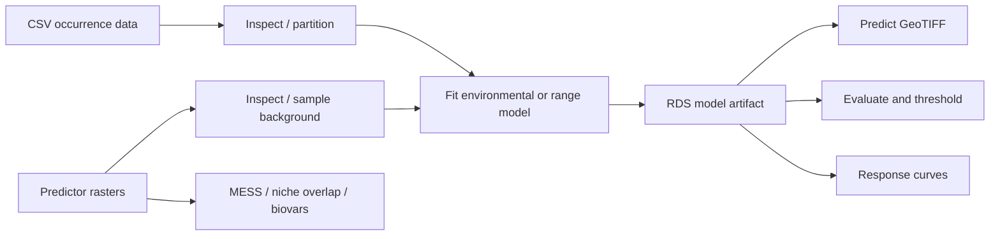

# dismo MCP 架构分析

## 官方项目基线

分析对象是官方仓库 [`rspatial/dismo`](https://github.com/rspatial/dismo)，而不是同名的
PyPI 包。`dismo` 是 R 的物种分布建模包；官方源码 `DESCRIPTION` 将其定义为
“Species Distribution Modeling”，核心依赖 `raster`、`sp`、`terra`、`Rcpp`，MaxEnt
另外需要 Java/`rJava`。本机实际安装版本为 `dismo 1.3.16`。

源码结构可分为五层：

1. `DistModel`、`ModelEvaluation` 及具体 S4 模型类。
2. BIOCLIM、Domain、Mahalanobis、MaxEnt 等环境模型与 `predict` 方法。
3. 凸包、矩形包络、圆包络等纯地理范围模型。
4. `randomPoints`、`kfold`、`pointValues`、`prepareData` 等数据准备函数。
5. `evaluate`、`threshold`、`response`、`mess`、`nicheOverlap`、`biovars` 等评估与解释函数。

## MCP 映射原则

MCP Tool 应表达完整领域动作，而不是一比一暴露每个 R 函数。比如 `evaluate_sdm`
一次返回 AUC、相关性、TSS、Kappa、常用阈值和完整阈值表产物，避免模型为了同一个
评估对象连续调用多个细碎工具。

## 协议与运行时选择

选择 Python FastMCP 3，而不是在 R 中自行实现 JSON-RPC：它提供成熟的 schema
生成、stdio/Streamable HTTP 传输、Resources、Prompts 和测试客户端。R 仍然是唯一
建模执行层，通过固定 `operation` 白名单和 JSON 文件协议调用。

每个 Tool 使用独立 `Rscript --vanilla` 进程。这样启动成本略高，但有三个重要收益：

- Java/原生扩展或大型栅格操作失败时不会破坏 MCP 主进程。
- 不共享 `.GlobalEnv`，并发请求之间没有模型或随机种子污染。
- R 的 stdout/stderr 不会污染 stdio MCP 协议；结构化结果从响应文件读取。

### 网络安全边界

stdio 默认不需要网络认证。HTTP、SSE 和 Streamable HTTP 通过统一 app factory 只绑定
回环地址，并且始终要求 `DISMO_MCP_BEARER_TOKEN` 或分别设置
`DISMO_MCP_READ_TOKEN` / `DISMO_MCP_WRITE_TOKEN`。外部访问必须经过 HTTPS 反向代理；
模块不再导出可绕过这些检查的全局 server。Token 使用常量时间比较，Tool 还按
`dismo:read` 和 `dismo:write` scope 做最小权限检查。HTTP 错误默认不暴露内部异常细节。

模型和输出写入 `.dismo-mcp/runs/<run_id>/`。后续工具只接受 `model_run_id`，服务端
从受控元数据中解析 `model.rds`。输入文件必须位于 workspace 或显式配置的
`DISMO_MCP_ALLOWED_ROOTS` 中。

### 可复现验证与空间合同

`partition_occurrences` 输出带有 `fold` 的 CSV。`fit_sdm` 收到 `folds_path` 与
`held_out_fold` / `train_folds` 后只读取训练折，并保存精确的 `training_points`
artifact。`evaluate_sdm` 用同一 CSV 的 `test_fold` 选取测试折，默认拒绝与训练点重复
的 presence 坐标；绕过检查必须显式设置 `allow_training_overlap`。

环境点输入声明 `point_crs`，范围模型声明 `crs`。R bridge 使用 `terra` 验证 CRS；
经纬度 CRS 强制执行经纬范围检查，空间操作会先投影到 predictor raster CRS。缺少
predictor CRS 会明确失败。范围模型的 `circles` 在生成和 GeoPackage 导出时保留用户
CRS。

生成的 background artifact 在结果中记录 `output_crs`。跨 Tool 传递时应使用
`background_run_id` / `absence_run_id`，路径形式则必须显式声明对应 CRS。环境模型会
保存 predictor manifest：输入文件及常见 sidecar 的 SHA-256、层名、层数、范围、分辨率
和 CRS；预测与评估在进入 R 前及 R 内部都会校验 manifest。

R bridge 使用有界并发槽位和队列，按配置限制栅格 cell 数、点表行数、输入文件大小和
R vector-heap 内存（`R_MAX_VSIZE`）。
`cancel_run` 可终止排队或运行中的 Rscript；超时、取消和队列失败都会写入 failed 状态。

## 后续扩展

第二阶段可以在不改变现有 Tool schema 的前提下增加：常驻 R worker 池、长任务进度
通知、真正的空间阻塞交叉验证、通用 GLM/BRT/RF 模型合同，以及对象存储后端。网络
数据获取应作为独立 provider 集成现代 GBIF API，而不应直接包装 `dismo::gbif`。
